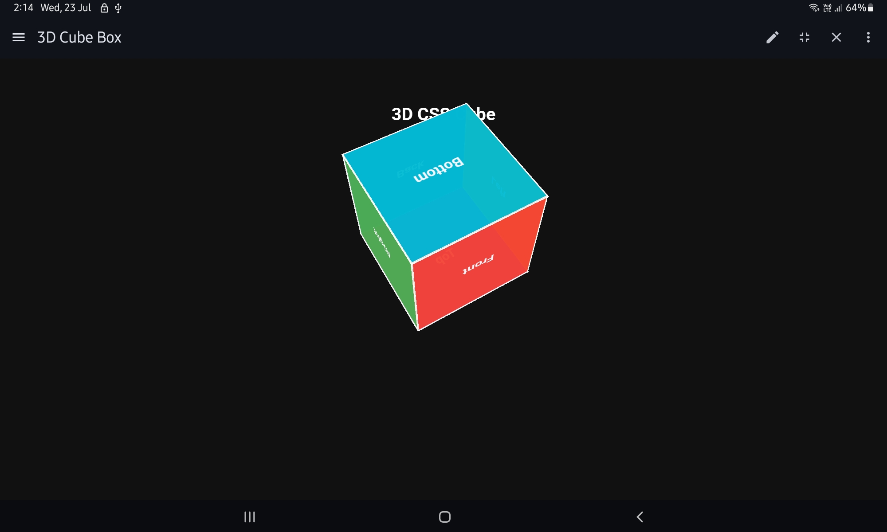
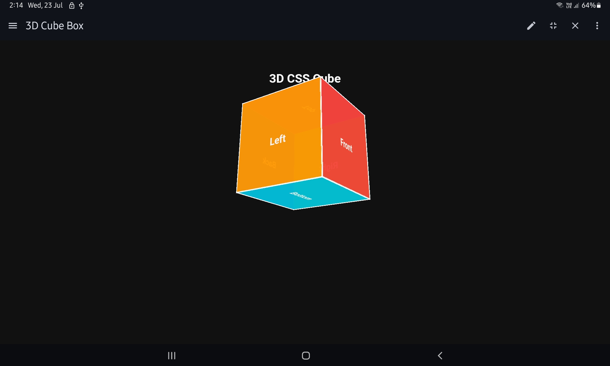
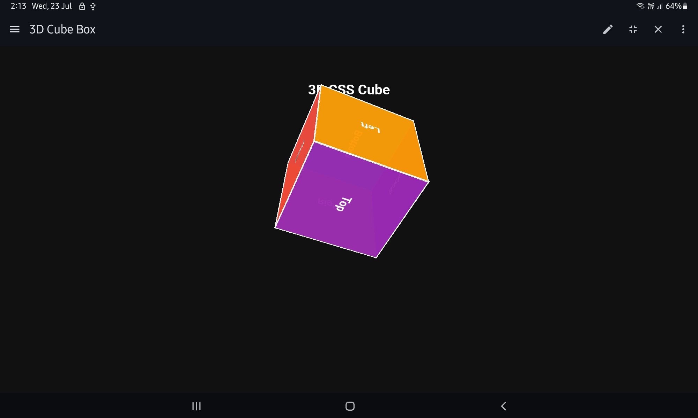
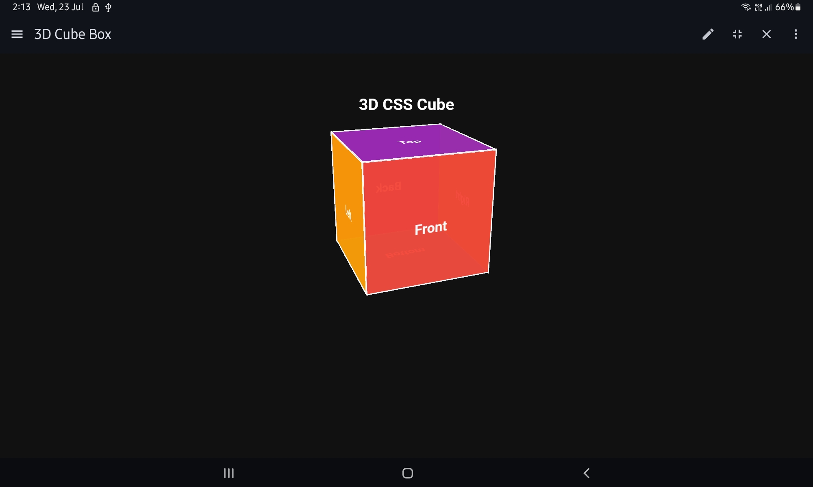

 3d-css-cube
It is a css styled 3d cube made with css using html too.
# 🎲 3D CSS Cube Animation

A smooth and interactive **3D cube** built using only **HTML and CSS** — no JavaScript required!

Hover over the cube to watch it rotate in 3D space.


## 🌐 Live Demo 
🔗[live code (pencode_link)]( https://codepen.io/Ascoder007/pen/MYayqJM )

🔗 [View Repo]
[ https://github.com/Ankit-Raj902/3d-css-cube ]


## 📸 Preview

  



_(Add a GIF or screenshot of the cube in action)_


## ✨ Features

- 🔧 Built with HTML + CSS only
- 🎲 Fully 3D cube with 6 colorful faces
- 🌀 Smooth hover rotation
- 🎨 Clean and minimal design
- ⚙️ Easy to customize


## 📁 Project Structure

📁 3d-css-cube/ ├── index6.html ├── index6.css └── README.md


## 📥 Getting Started

To view or edit this project:

1. **Clone the repository:**
   ```bash
   https://github.com/Ankit-Raj902/3d-css-cube.git
   

2. Open index.html in your browser


3. Hover your mouse over the cube and enjoy!


👨‍💻 Author

Made with ❤️ by __Ankit Raj__


📄 License

This project is licensed under the MIT License


⭐ Contributions

Feel free to fork this project, customize it, and create pull requests!


✅ Let me know if you want this:
- In downloadable `.md` format
- Translated to Hindi or bilingual
- With your actual name, GitHub username, and live link pre-filled

Just say the word! 🚀


